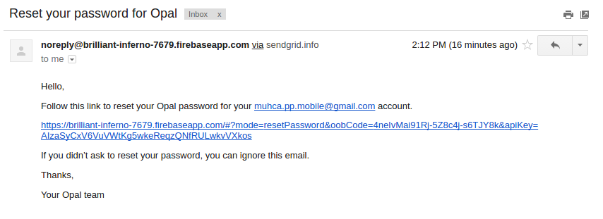
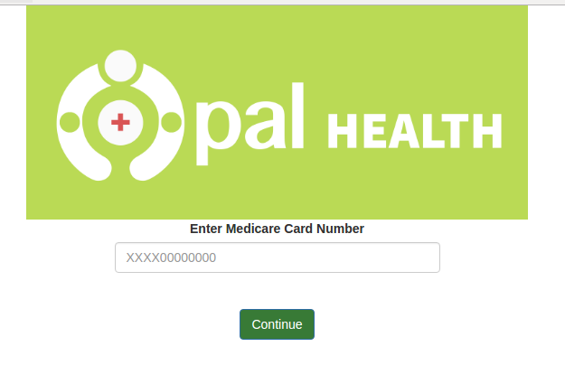
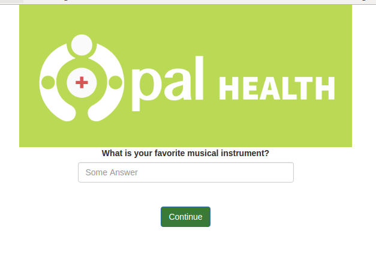
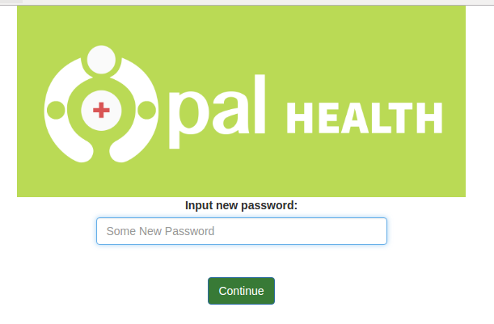

# Opal Password Reset

## Summary

This document outlines the requirements design and implementation of Opal’s password reset functionality.

## Previous Version

Prior to the release of Firebase API 3.x, the password resets flow involved the following steps:
1. User enters email
2. A temporary password is created for and emailed to the user
3. User signs in with the temporary password
4. User enters his/her Medicare Card Number
5. User answers a security question
6. User enters a new password

After the release of Firebase API 3.x, Firebase no longer creates a temporary password for the user, but emails the user a link to a password reset page.

## Requirements

Based on the recommendations of the MUHC security team, the password reset flow contains three distinct security checks:
1. Entering a valid user email
2. Verifying the user’s Medicare Card Number
3. Verifying the user’s answer to a randomly chosen security question.

In addition to the above, the reset process must be simple and easy to use. It should also provide appropriate feedback.

## Design
### Hosting
Due to the fact that Firebase sends a password reset link to the user, users must access their email accounts and follow the link to an external webpage. This webpage is hosted on Firebase. Upon release of the Opal web portal, the password reset page will be integrated with the rest of the application.

### Language
The password reset page and email must be provided in both English and French.

## Implementation
As with the rest of the Opal app, development is carried out using AngularJS and Bootstrap.
### Controller
There is a single controller resetPasswordController.js that handles the data in and out of the view. 

Upon initialization, the controller grabs the query string parameters from the URL and verifies the Firebase generated code sent to the user against Firebase’s records.

There are three main functions 
* submitSSN(ssn)
* submitAnswer(answer)
* submitNewPassword(newPassword)

These functions are bound to the scope and are successively called as the user clicks on ‘Continue’ in the view.

### Services
Theres are two services requestService, ResetPasswordRequest that enable the controller functions to execute. ResetPasswordRequest is a service that communicates with firebase and is based on the Opal app service requestToServerService,  while requestService handles the promises returned by the requests.
## Firebase
Before Firebase 3.x, Firebase’s password reset would set the user’s password to a temporary one. This allowed the user to login and be authenticated with Firebase. However, since the password reset now emails a link and the verification only returns the user’s email, the user is not authenticated with Firebase. Thus, new rules were created to allow public temporary writing and reading from Firebase.
## Server Side
The SQL queries now searches for user information based on email address as opposed to the previously used UserID. Listener has been changed to additionally listen for passwordResetRequests.

#Usage

1. Reset Password Link

2. Reset Password Page

3. Answer question page

4. New Password Page

